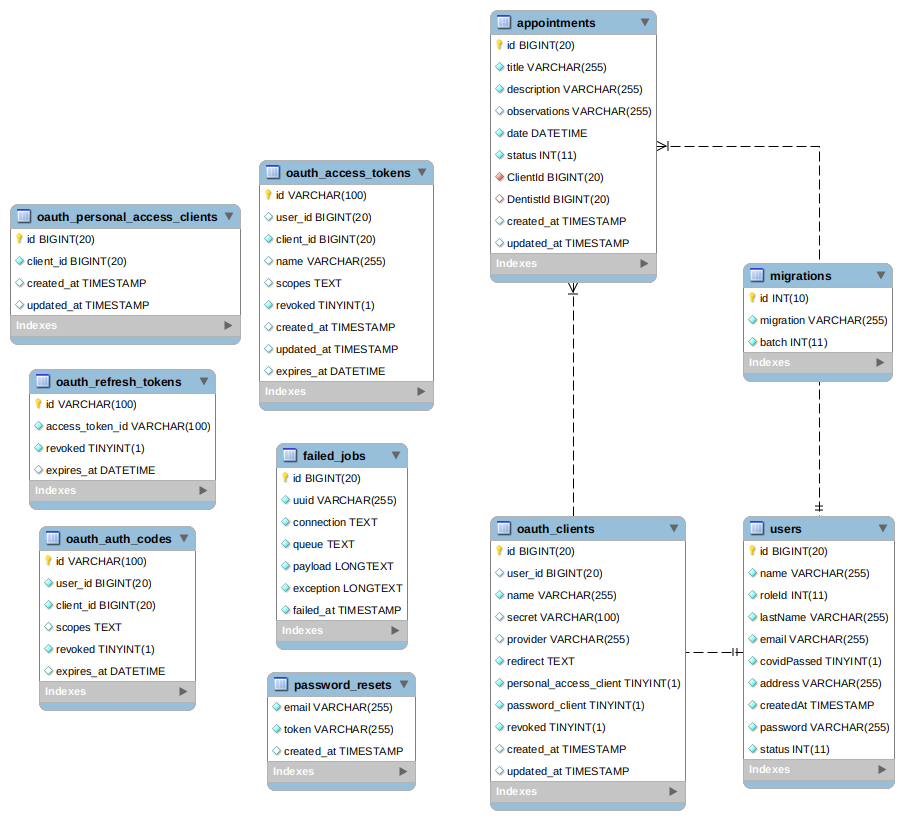

# Rest API in LARAVEL for a Dental Clinic

This is a project to introduce the use of PhP and Laravel.

### Where to test the demo
 - Backend -> http://thawing-cove-71320.herokuapp.com/api/
 - Frontend -> https://front-clinica-dental.herokuapp.com/

### A bit of background
This is an example of a backend for an appointment app for a dental clinic.

We have 2 roles for user: Client, Dentist / Admin.
The Client can see the previos appointments and create new ones in 'pending' state
The Dentist / Admin can see previos appointments from a certain Client, see own history of appointment. Also and create new appointments and change the status of them.

### Data Structure



### Software needed
- PhP 7.4
- MariaDB
- Composer
- Laravel

### Get the repo
- git clone https://github.com/RafaLinaresMolina/laravel_backend_clinica_dental

### Install dependencies
- ```composer update```
- ```php artisan migrate```
- ```php artisan passport:install```

### Configuration 

- the laravel config occours in the .env file:
  - Need to set up the Database config and project

### How to run it.
- ```php artisan serve```

## The endpoints

### AUTH 
- post -> /auth/login -> Allow user to obtain session token
- post -> /auth/register -> Allow the creation of a new user
- **Routes protected by Auth**
  - Admin routes
  - **Routes protected by Role:0 -> Admin/Dentist**
    - User Logic
      - get -> /users -> Obtain all the users
      - get -> /user/{id} -> Obtain the desired user
      - post -> /user -> Create a new user 
      - put -> /user/{id} -> Edit the desired user
      - delete -> /user/{id} -> Soft-delete the desired user
       
    - Appointment Logic
      - post -> /admin/appointment/create -> Create a new appointment with status accepted
      - get -> /admin/appointments -> Get all the appointments.
      - get -> /admin/appointments/client/{id} -> Get all the appointments from the desired Client
      - get -> /admin/appointments/dentist/{id} -> Get all the appointments from the desired Dentist/Admin
      - put -> /admin/appointment/accept/{id} -> Change the estatus to accepted
      - put -> /admin/appointment/done/{id} -> Change the status to done
      - delete -> /admin/appointment/{id} -> Change the status to cancelled
 
    - Client Routes
      - get -> /client/appointments -> Get all the client appointments
      - post -> /client/appointment -> Create a new appointment with status pending
      - delete -> /client/appointment/{id} -> Change the status to cancelled

    - Profile Routes
      - get -> /profile -> Retrive the user profile info
      - put -> /profile -> Allow edit the info of the User
      - delete -> /profile -> Soft-delete the account
